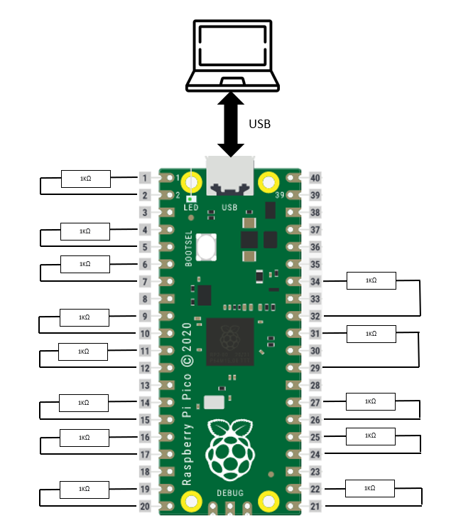

# ROBOT FRAMEWORK PICO TEST
## Hardware


Pico is connected to PC via USB connection.
GPIO's are connected 2 by 2 throught 1KΩ resistor.

## Tests
### How to launch tests
Firmware mount 2 serial port (/dev/ttyACM0 and /dev/ttyACM1)
You need to open /dev/ttyACM0 in a terminal to make the firmware run:
    Example:
    ```bash
    minicom -D /dev/ttyACM0 -b 115200
    ```

Then:
```bash
cd ~/panduza-adapters-sdk/examples/pza-pico-modbus-dio/test/tests
robot Test_Cases.robot
```

### Logs
Logs are located at : ~/panduza-adapters-sdk/examples/pza-pico-modbus-dio/test/tests


